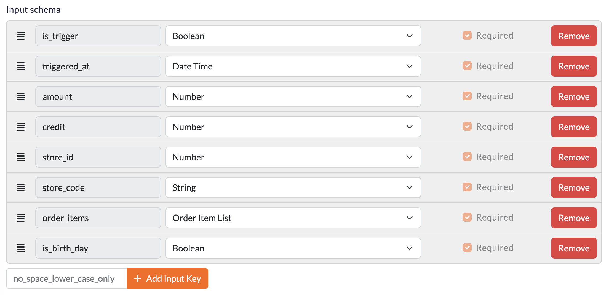
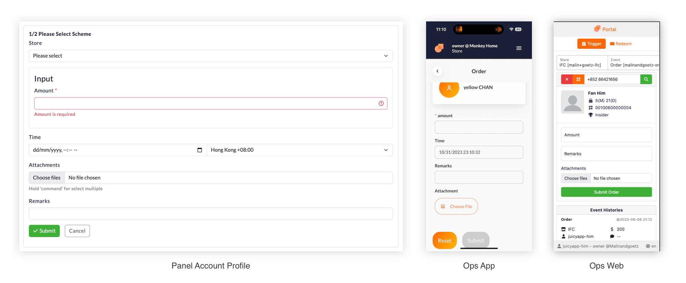

# Event
Is one of the **3 Interactive Component** of Loyalty Engine. Event is the entry point of any Loyalty actions. It can be triggered by external system, such as POS, Operation Portal / Admin Panel or via API for custom campaign.

## What Event can do
Controlling how a event can be triggered, and what data can be passed along with the event. Every account can trigger any active event within the loyalty program.

## Define Input Schema
InputSchema is to define the data structure to be passed along with the Event trigger. It is a JSON Schema. For more information about JSON Schema, please visit [JSONSchema Offical Site](https://json-schema.org/).

### Setup UI
For ease of use, we provide a UI for setup the InputSchema. It is a object type schema with fixed choice of data type. You can add as many fields as you want. The UI will generate the JSON Schema for you.

#### Readable Data Type for Loyalty Engine
 - `string` - text, email, store code, etc
 - `number` - order amount, date of birth, etc
 - `boolean` - is birthday, is first purchase, etc
 - `datetime` - trigger time, order time, etc
 - `array-of-objects`
     - Data structure that contain multiple fields
     - Can be order items object which include `sku`, `price`, `quantity`, etc
 - **All input must required, otherwise mission formula builder may not recognize**

### Trigger UI
To trigger an event, you can use the trigger UI. It is a form generated by `InputSchema` you defined. You can also use the API to trigger an event. Here are some example of how trigger UI looks like. **Please note that some properties are hidden which is reserved generated by system**

## Model and Fields

### Event Scheme
|Field|Explainations|
|---|---|
|id|Primary Key|
|code|Unique Identifier|
|input_schema|Define Input |
|activate_at|Won't accept trigger **before** it|
|expire_at|Won't accept trigger **after** it|

### Event
|Field|Explainations|
|---|---|
|id|Primary Key|
|account_id|Reference to the account holder|
|input|Data submitted along with the Event trigger, will pass along to mission for progress calculations|
|triggered_at|Time when the event is triggered|
