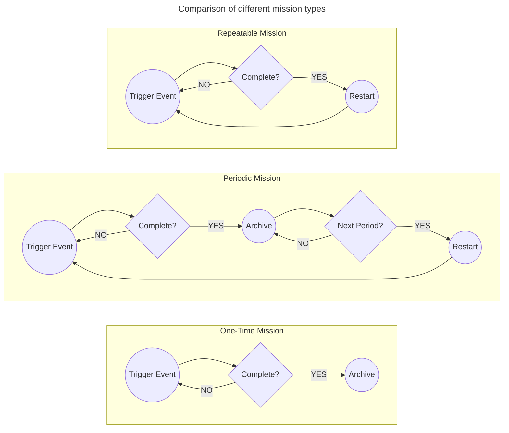
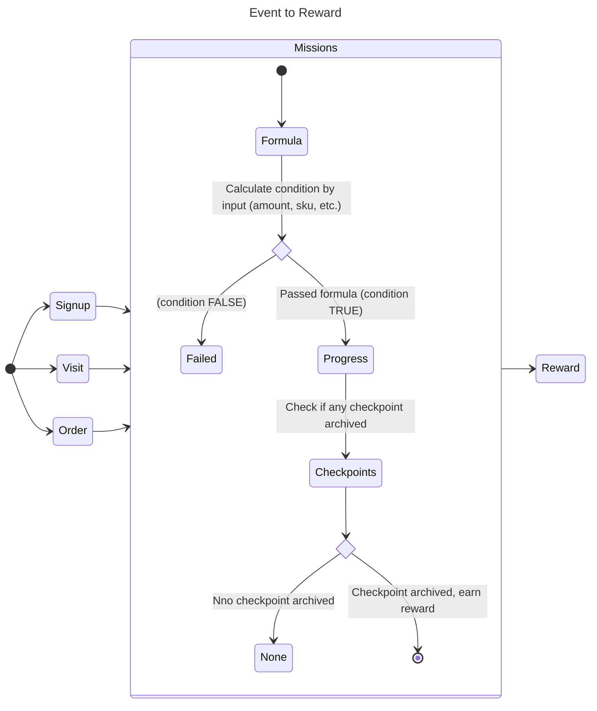
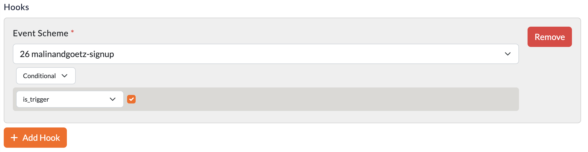
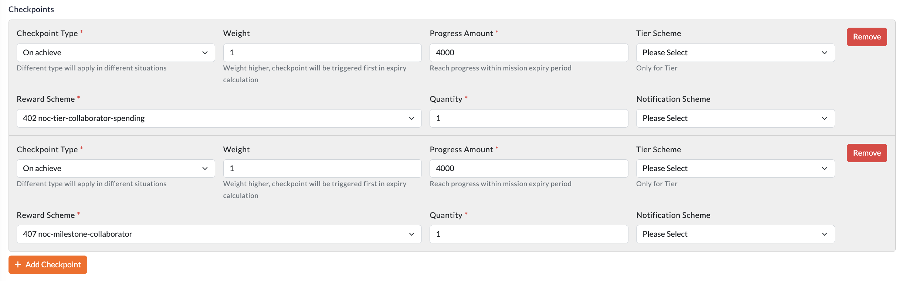

# Mission
Is one of the **3 Interactive Component** of Loyalty Engine. All loyalty logics from events to rewards are defined in Mission. Mission can be assigned to account in the very beginning, or being rewarded by other missions, redeem.

## What Mission can do
- **Hook** - Listen to event and calculate the progress of the mission
- **Reward** - Issue reward when progress archived certain amount

## Mission Type
Mission will have different behaviour based on its type. There are 3 types of missions:

- **One-Time** - Once the mission is completed, it will be archived and cannot be completed again.
    - e.g. Signup, First Order, etc.
- **Periodic** - The mission can be completed multiple times, but only once per period.
    - e.g. Birthday, Monthly Campaign, etc.
- **Repeatable** - The mission can be completed multiple times. No periodic limit.
    - e.g. Order, Visit, etc.

## Earn by Trigger vs. Expire
- **Trigger** - When a event is triggered, event data will pass to formula to calculate the progress of the mission, and archive the checkpoint if any.
- **Expire** - The moment before the mission is expired, the mission will check if any checkpoint failed or meet. If yes, the reward will be issued.

## From Event to Reward
A brief concept of how a Event undergoes the process of earning reward.

## From Event - `MissionSchemeHook`

### Setup UI
Hook is a listener to event. It will be triggered when the event is fired. The hook will then calculate the progress of the mission and archive the checkpoint if any.

 - Hooks can be multiple
 - A hook must bind to a `EventScheme`
 - A hook must set a `Formula`

## To Reward - `MissionSchemeCheckpoint`

### Setup UI

- **Checkpoint Types** - There are 3 types of checkpoint, `on-achieve` will be fired **during event trigger**, `on-meet` and `on-fail` will be fired **during mission expiry**.
    - `on-achieve` - The reward will be issued when the progress amount is **passed** the `Progress Amount`
    - `on-meet` - **v0.5.15**  The reward will be issued when the progress amount is **passed** the `Progress Amount` before the mission expired.
    - `on-fail` - The reward will be issued when the progress amount is **not passed** the `Progress Amount` before the mission expired.
- **Progress Amount** - The amount of progress to archive the checkpoint
- **Tier Scheme** - Only account with the tier will be able to earn the reward
- **Weight** - **v0.5.15** During expiry, the reward with higher weight will issue before the lower one, mostly used for deactivating other missions before other checkpoint calling (For `on-meet` only)
- **Reward Scheme** - The reward to be issued
- **Quantity** - The quantity of the reward to be issued
- **Notification** - A notification will be sent to the account when the checkpoint is archived. (Out of Loyalty Engine Scope)

## Model and Fields

### MissionScheme
|Field|Explanations|
|---|---|
|id|Primary Key|
|code|Unique Identifier|
|type|**Detail explanations on above**  `one-time` `periodic` `repeatable`, |
|overflow_repeatable_progress|**repeatable only** The last repeated mission progress will truncated to 0 in a event trigger.|
|max_completion_count|**repeatable only** How many times the mission can be repeated|
|max_progress_amount|If passed the mission `status` will be `completed`|
|initial|If TRUE, account will be assigned automatically when created|
|expiry_setting|When will the mission expire from **earning time**|
|activate_at|All `Missions` belong to this `Scheme` won't operate **before** it|
|expire_at|All `Missions` belong to this `Scheme` won't operate **after** it|
|status|Global control of all `Missions` belong to this `Scheme`.  `active` - Will distribute in initial and operate `disabled`, `removed` - Won't distribute in initial and won't operate|

### MissionSchemeHook
|Field|Explanations|
|---|---|
|id|Primary Key|
|event_scheme_id|The `EventScheme` it listen to|
|formula|**Detail explanations on above** Define `Formula`,|

### MissionSchemeCheckpoint
|Field|Explanations|
|---|---|
|id|Primary Key|
|type|**Detail explanations on above** `on-archive`, `on-meet`, `on-fail`|
|progress_amount|Amount to earn the reward|
|weight|**Detail explanations on above** Reward issue priority|
|reward_scheme_id|Reward to be issued|
|quantity|Amount of Reward to be issued|

### Mission
|Field|Explanations|
|---|---|
|id|Primary Key|
|account_id|Referring the account which it belongs|
|expire_at|won't operate **after** it|
|issued_at|Time of mission record added to account|
|source|`reward` - Earned from `mission` or `reward` issue / redeem  `direct` - Direct  issue `initial` - Issued when account created  `renewal` - Created from last repeated mission, or a new one from last periodic mission|
|status|`active` - normal and operating `completed` already completed and archived `disabled` - had been stopped from operating `renewed` - replaced by newer one and archived `expired` - had been processed by **expiry cron job** and archived|
|reprat_count|For consolidation when the mission had been completed multiple times in a Event trigger|

### MissionProgress
|Field|Explanations|
|---|---|
|id|Primary Key|
|amount|Actual Progress Amount|
|intended_amount|Should be equal to `amount` in normal situations. Not for calculation. Can be used when max progress reached but still want to calculate how much progress it gain|
|source|`direct` - Direct issue progres (via admin panel) `hook` - From hook listened from event trigger `inherited` - Passed from overflowed progress of a completed mission. **Please see reward component** `overflow` - A "remainder" progress from a last repeated mission, only on `repeatable` mission with `overflow_repeatable_progress` turn on `reward` - Issued by a reward with `mission_progress` Unit type|
|issued_at|Time of the progress added|