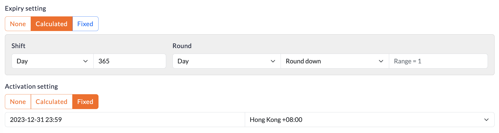

# Point
One of the **3 Basics Components** of Loyalty Engine. Point is the most common component in loyalty program. Point is earned by spending, redeem for item(discount).

## What Point can do
 - **Redemption** - Redeem a reward, which can be Items, Tier, or other Points
 - **Integration** - Spend as cash / credit on POS
 - **Mission Condition** - As a condition in formula builder for Mission (Can check in mission topic)

## Amount Calculation
Point amount is calculated by sum of amount of all Point records. Point record is created when Point is earned or used. **Do not edit amount directly, this may cause serious calculation issues!!**

## How point is used
Usage amount will applies to the Point record with the pirority **Soon Expire** -> **Oldest**  and  If the usage amount is greater than the Point record amount, the usage will split into 2 amounts, and pass to the next Point record. This process will repeat until the usage amount is 0. Exception wil thrown if run out of Point record but still have usage amount.

## Time Settings
When working of activation and expiry time, we have to use "TimeSetting" component. It consist of calculate **shift** & **round** or a **fixed** time to create different calculation logics. **It is timezone sensitive please always to have utcOffset provided**

- **Shift** - Add a time shift from the issue time, e.g. `Day +1`, `Month +2`
- **Round** - Round the time to a specific time after **shift**
    - e.g.`Day RoundUP (Be the end of that day)`, `Year RoundDown (Be the start of the year)`
    - A special **Range** option is available when rounded by a count of the unit e.g. **2 Days**, **3 Month** etc.
- **Fixed** - Use a fixed time, e.g. `2020-01-01 00:00:00`. **Please always set it after the issue time otherwise error may throw in some situations**
- Examples:
    - **Shift** `Day +1` **Round** `Day RoundDown`
        - **Issue Time** `2020-01-01 03:00:00` = **Activate Time** `2020-01-02 00:00:00`
    - **Shift** `Year +1` **Round** `Year RoundDown`
        - **Issue Time** `2020-01-01 03:00:00` = **Activate Time** `2021-01-01 00:00:00`
## Model and Fields

### Point Scheme
|Field|Explainations|
|---|---|
|id|Primary Key|
|code|Unique Identifier|
|expiry_setting|When will the point expire from **earning time**|
|activation_setting|When will the point activate from **earning time**|
|init_amount|Point issued once the account is created|
|activation_setting|When will the point activate from point earning time|
|should_activate_init_points|For case when `init_point` and `activation_setting` set. If TRUE, the `init_point` will ignore activation calculation and can be use instantly. |
|max_amount|How much point amount an account can held, if exceeded, point will still issued but amount remain to the ceiling |

### Point
|Field|Explainations|
|---|---|
|id|Primary Key|
|account_id|Reference to the account holder|
|amount|Actual amount for point calculation, can be `+ve` or `-ve`|
|intended_amount|Should be equal to `amount` in normal situations. Not for calculation. Can be used when max point reached but still want to calculate how much earned in total|
|source|`direct` - Issue to account directly  `reward` - Earned from `mission` or `reward` issue  `initial_point` - by `init_amount` in scheme `redemption` - From redeem a `reward`|
|issued_at|Time of point record added to account|
|activate_at|Won't able to use **before** it|
|expire_at|Won't able to use **after** it|

### Point Usage

|Field|Explainations|
|---|---|
|id|Primary Key|
|point_id|Referring to the point (`+ve`) where it used on |
|source_point_id|Referring to the use (`-ve`) point records|
|amount|Usage amount|
|used_at|When the usage created|
