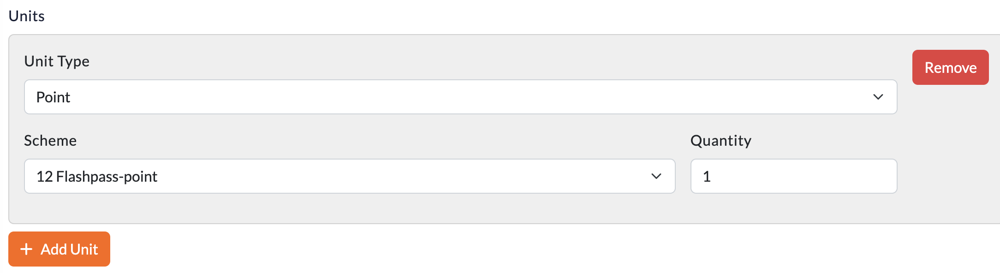
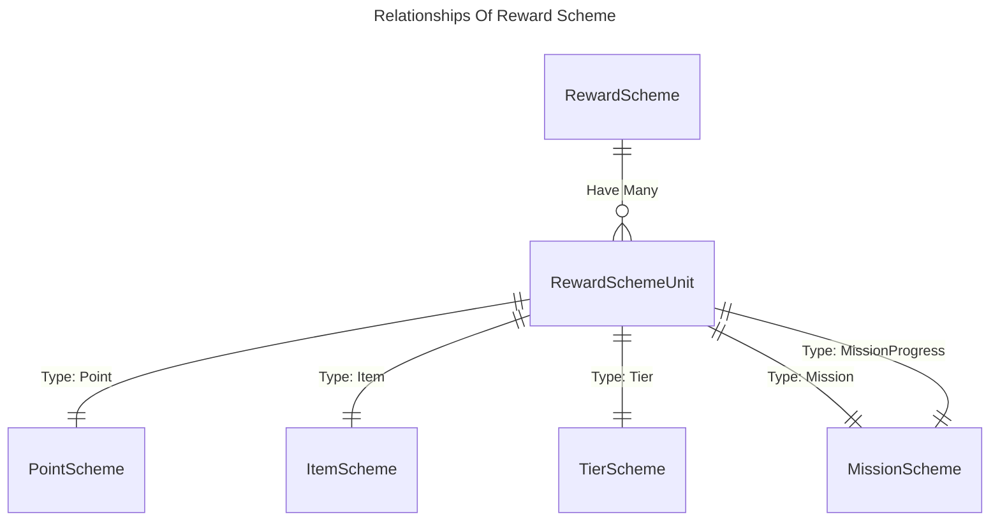
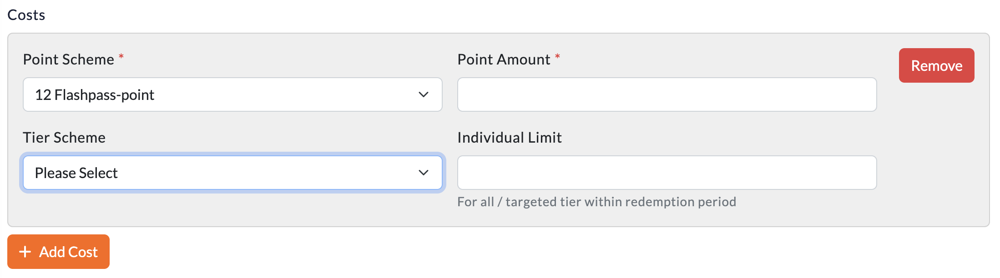

# Reward
One of the **3 Interactive Components** of Loyalty Engine. Reward act as a "carrier" in the loyalty program, issuing components to account from different situations. Reward can be earned by `Mission` or `Event`, and can be redeemed by `Point`.

## What Reward can do
- **Container** of rewardable components - `Point`, `Item`, `Tier`, `Mission`.
- **Redeemable** by point, which will then issue the rewardable components to account holder.
- **Bridge** between `Mission` and `Account`, earning components by completing missions.

## Container = `RewardSchemeUnit`
`RewardSchemeUnit` is a setup for rewardable components. It is a container for rewardable components, options might be different for different rewardable components.

### Setup UI

### Available Unit Types
- **Point**
    - To bind with `PointScheme`
    - Options
        - `Quantity` - Amount of point to issue
- **Item**
    - To Bind with `ItemScheme`
    - Options
        - `Quantity` - Amount of item to issue
- **Tier**
    - To Bind with `TierScheme`
    - Options
        - `Extension` - Extends the expiry of user's existing tier by 1 period (specified by Quantity). Has no effect if user does not have the specified tier.
        - `Force` - Sets user's tier to the specified one even if the current tier rank is higher than its. **Should always use this**
- **Mission**
    - To Bind with `MissionScheme`
    - Options
        - `Deactivation` - Deactivates user's mission if it exists and is active.
        - `Inheritance` - Mission issued by this will inherits all overflowed mission progress. i.e. If the mission max progress is 10, and user earned 13 progress, the mission issued by this will have 3 progress which passed by the previous one.
- **Mission Propgress**
    - To Bind with `MissionScheme`
    - It is not rewarding a mission, but just progress of mission with the scheme than the account holder already have.
    - Options
        - `Quantity` - Amount of mission progress to issue

## Redemption = `RewardSchemeCost`
`RewardSchemeCost` is the setup for how the reward can be redeemed. It specifies the cost of the reward, and the limitation / rule of the redemption.

### Setup UI

 - Input Fields
     - `Point Scheme` - The point scheme that will be used to redeem the reward
     - `Point Amount` - The amount of point that will be used to redeem the reward
     - `Tier Scheme` - The tier scheme that will be allowed to redeem the reward
     - `Limit` - How many times the reward can be redeemed by the same account, **within redeemable period (`redeemable_from` to `redeemable_to`)**, leave **empty means unlimited**
 - Each `RewardScheme` can contains multiple `RewardSchemeCost`
 - ** Start from version 0.5.8, reward will be redeemed by single cost only. Account have to select which cost to redeem. This is to prevent the case that account holder redeem the reward with the cost that they don't want to spend.

## Model and Fields

### Reward Scheme
|Field|Explanations|
|---|---|
|id|Primary Key|
|code|Unique Identifier|
|quota|How many time able to redeem overall (just like stock limits). **Empty means unlimited**|
|redeemable_from|Won't able to redeem **before** it|
|redeemable_to|Won't able to redeem **after** it|

### Reward Scheme Cost
|Field|Explanations|
|---|---|
|id|Primary Key|
|point_scheme_id|What kind of Point to redeem|
|point_amount|How much point need to redeem|
|tier_scheme_id|Which Tier is allow to redeem|
|limit|Individual limit **within redeemable period (`redeemable_from` to `redeemable_to`)**. **Empty means unlimited**|

### Reward Scheme Unit
|Field|Explanations|
|---|---|
|id|Primary Key|
|type|**Detail explaination on above**  `point` - Issue Point  `item` - Issue Item  `tier` `tier_extension` `tier_force` - Issue Tier  `mission` `mission_deactivation` `mission_inheritance` - Issue Mission   `mission_progress` - Issue Mission Progress|
|target_id|`scheme_id` of type, for bindings|
|quantity|Number of components to be issued|
|should_instantly_activate|If TRUE, components issued will ignore `activation_setting` **Better off by default** **Please update Loyalty Engine UI > 1.0.2 for the version to be off by default** |

### Reward
|Field|Explanations|
|---|---|
|id|Primary Key|
|account_id|Reference to the account holder|
|issued_at|Time of reward record added to account|
|source|`mission` - Earned from mission checkpoint by Event Trigger `direct` - Issue to account directly  `redemption` - By redeem |
|quantity|Number of components had been issued|