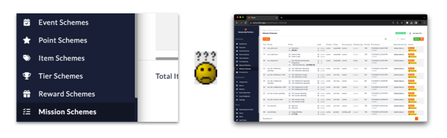
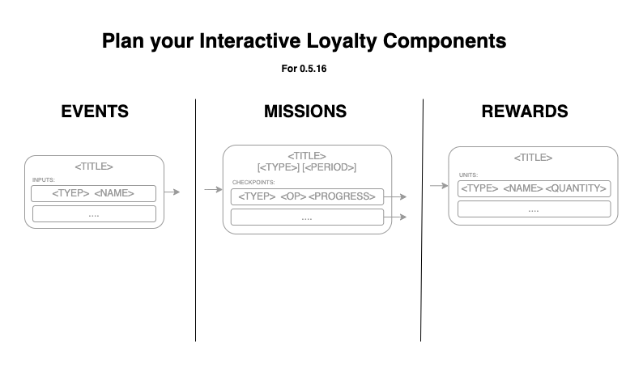
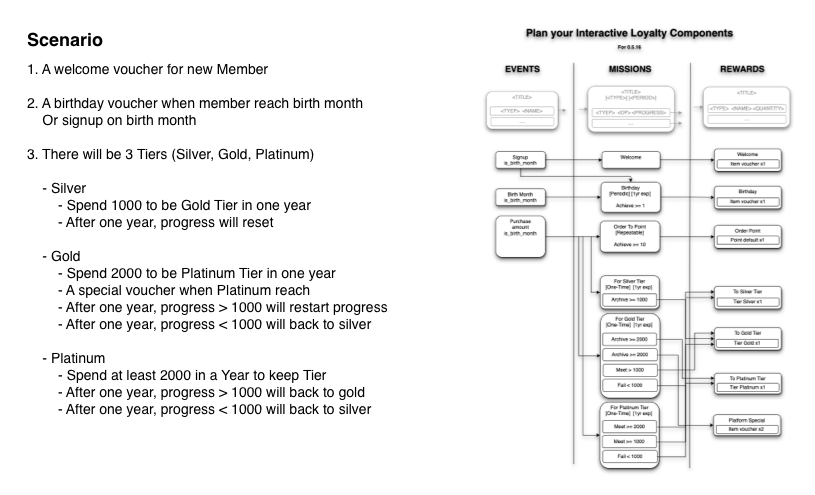
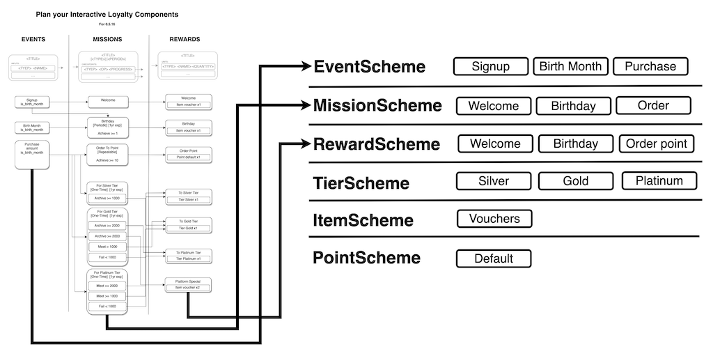
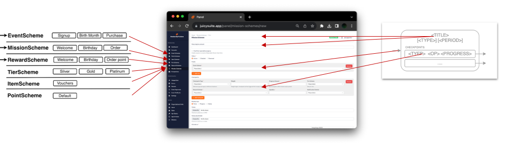
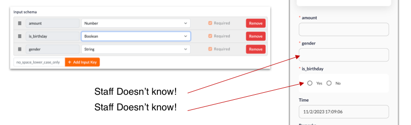

# Plan a Loyalty setup
Will describe a formal way to plan a loyalty setup. And also the limitations of the current system.

## Always **PLAN** before doing actual setup

### Directly Start from panel setup may cause confusion


 - Admin panel breaks down the whole setup into different components, It's hard to understand the whole picture.
 - If the setup done wrongly, it may need to redo the whole setup again. (e.g. Delete all the missions and rewards) very time consuming... **For platform / a running program, wrong setup will cause great trouble**.
> ### Therefore a planned diagram is needed
 - Diagram is not that hard to draw, we only work on **Interactive Components**, and the relationship between them.
 - Once a diagram is done, it can be used to proofread the setup. Review with client and make sure the setup is correct.
 - A diagram can be passed to OPS team (if any) for actual implementation. and also keep as a reference for any future changes.
 - Even a professional setup guy, a diagram is recommended for team communication and reference for new comers.
#### Template Diagram, feel free to use



### Steps to plan a Loyalty setup
This document author has been working on loyalty setup for 2 years, with different clients, different scenarios. The following steps are the most organized way to plan a loyalty setup.

1. #### From Scenario to Components
    Draw the diagram from Client's scenarios
    

2. #### Categorising components lists
    Extract all schemes from diagram, and categorize them into different lists.
    
1. #### From Component to Panel UI
    More easy to setup the panel and enter it one by one.
    

## Understanding the **Limitations**
While doing the planning, we have to bear in mind the limitations. And while dealing with client, we have to explain the limitations to them. And any workaround if possible.

### ONE `Mission` = ONE `Reward`
- Assume mission only have 1 kind of reward
    ```mermaid
    ---
    title: (WRONG) Issue different Reward by single Mission
    ---
    flowchart LR
    e1["Order Event: Store: A"]
    e2["Order Event: Store: B"]
    subgraph m [Order Mission]
        c1([Checkpoint 1 - amount 100])
        c2([Checkpoint 2 - amount 100])
    end
    subgraph "Rewards"
        r1[Discount 10%]
        r2[Free Cake]
        c1-->r1
        c2-->r2
        c1-."Still Issue".->r2
        c2-."Still Issue".->r1
    end
    e1-->m
    e2-->m
    ```
- Although we can control checkpoint reward by tier, most of the cases can't handle:
    - e.g. Different Store / Different sku have different rewards
- If would like to have different rewards, we can use different mission
    ```mermaid
    ---
    title: (CORRECT) One Mission One Reward
    ---
    flowchart LR
    e1["Order Event: Store: A"]
    e2["Order Event: Store: B"]
    subgraph m1 [Order Mission Store A]
        c1([Checkpoint 1 - amount 100])
    end
    subgraph m2 [Order Mission Store B]
        c2([Checkpoint 1 - amount 100])
    end
    subgraph "Rewards"
        r1[Discount 10%]
        r2[Free Cake]
        c1-->r1
        c2-->r2
    end
    e1 --> m1
    e2 --> m2
    e1 -.BLOCKED.-x m2
    e2 -.BLOCKED.-x m1
    ```
- However more missions will be createad
- Will gonna solve this in the Future plan -- Hook to reward

### Need more Event Inputs
Inputs from event might needed to generate in the system.

- `Reserved` vs `Input`
    - **Reserved** - System will auto fill in
    - **Input** - User need to input via OPS app or API
- If extra information is needed but not available or shouldn't entry by OPS / API, need to be **Reserved**, and need to be generated in the system.

