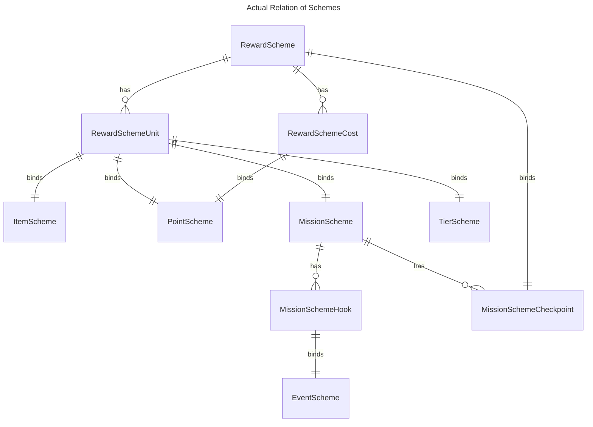
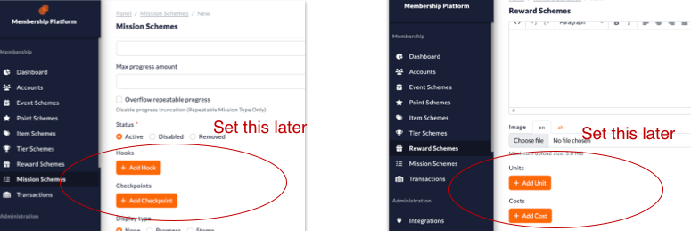
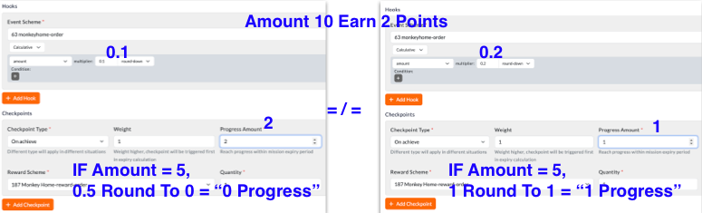
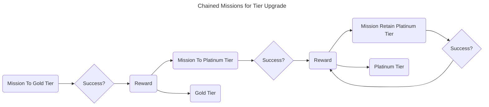
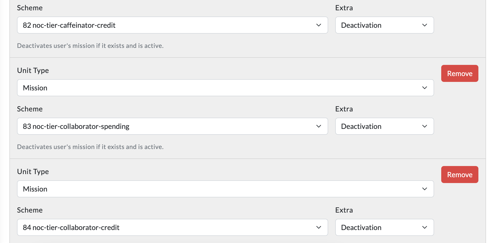
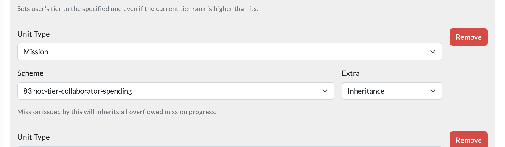
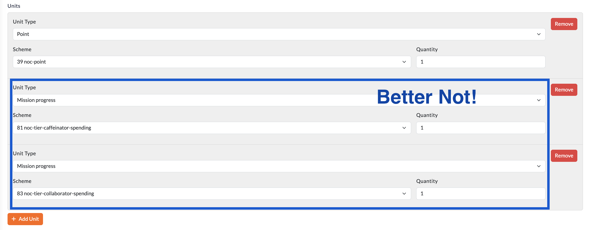

# How to setup via admin panel
Once the diagram is done, and the components are listed, we can start to setup the panel.

## Deal with the relations

- Scheme relation are messy, schemes depends on each other. We can't start from any scheme since those scheme ain't able to create without other schemes.
- But first of all, those relations are binded from sub items of Interactive Schemes i.e. `RewardSchemeCost`, `RewardSchemeUnit`, `MissionSchemeCheckpoint`, `MissionSchemeHook`
    
- By eliminating those sub items, Schemes components will independent to each other. and we can setup them one by one.

## Recommended steps to setup
This document author has been working on loyalty setup for 2 years, with different clients, different scenarios. The following steps are the most organized way to setup in admin panel.

1. PointScheme
2. ItemScheme
3. TierScheme
4. EventScheme
5. MissionScheme (Not Hook and Checkpoint)
6. RewardScheme + RewardSchemeUnit, RewardSchemeCost
7. MissionSchemeHook + MissionSchemeGroup

>First we can start on all **Basic Components** as they are more easy, then we go for `EventScheme` as it always the entry point. Then we setup `MissionScheme` by just creating the mission, but not the hook and checkpoint.

>After that, we have only `RewardScheme` left. We do a complete setup on `RewardScheme` including `RewardSchemeUnit` and `RewardSchemeCost`. **Since we have all the schemes setup, we doesn't needed to go back create other scheme again.**

>Finally we go back to `MissionScheme` to setup `MissionSchemeHook` and `MissionSchemeCheckpoint`. And we are done.

**This steps also applies to creating seed file in starter project!!**

## Seems many ways to setup a rule
**But there are sligthly different in the result!!**

- ### Formula vs Checkpoint
    Some times a calculation can be done by formula or checkpoint. But the result is different.
    

    - Above examples, Left use `formula 0.1 * 2 quantity` while Right use `formula 0.1 * 1 quantity`
    - Since formula has rounding config, it will round up the result.
    - `0.5` amount will still earn 1 point in the left example, while 0 point in the right example.

- ### Checkpoint vs Reward
    - Other than Checkpoint, RewardSchemeUnit also can control the quantity, but reware that if the reward is used in other mission, it will also be affected.
    - Therefore it's recommended to use Checkpoint to control the quantity.
    - We can think in a direction that, Setting "closer" from the event trigger will more fit to the scenario, "farther" from the event trigger will more affect the whole program.

## Guide on setup chained Missions
Chained Missions are missions that linked on other missions. This is very common for Tier upgrade loyalty program. Since every Tier might have different expiry period, rules etc. We have to create different missions for each tier, and chain them together.

- ##### Rule No. 1 - Always use **One-Time** Mission
    Since we are using chained missions, we have to make sure the mission is one-time only. Otherwise the mission will be triggered again and again.
- ##### Rule No. 2 - Be sure **deactivate** other missions in `RewardSchemeUnit`
    Make sure only one mission is running at a time, must deactivate other missions in the chain. **Start From 0.5.16, can deactivate all other missions even account might not have it**.
    
- ##### The `Inheritance` in `RewardSchemeUnit` Option
    Use it when passing the "exceeded" mission progress to next one. e.g. If Silver Mission need 1000 to Gold, When user have 1500, the 500 will be passed to Gold Mission.
    
- ##### Use `MissionProgress` in `RewardSchemeUnit` ?
    You might thinks that can set the `MissionProgress` in `RewardSchemeUnit` along with order points reward scheme, and one reward and one mission can be done in one go. But it is not recommended. Because when client needed to have 2X points event, the mission progress will be doubled. So better not to keeps the flexibility.
    
