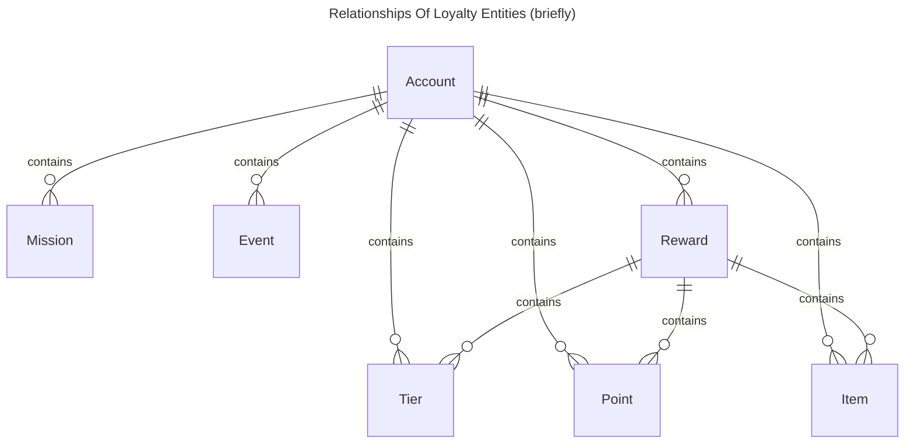
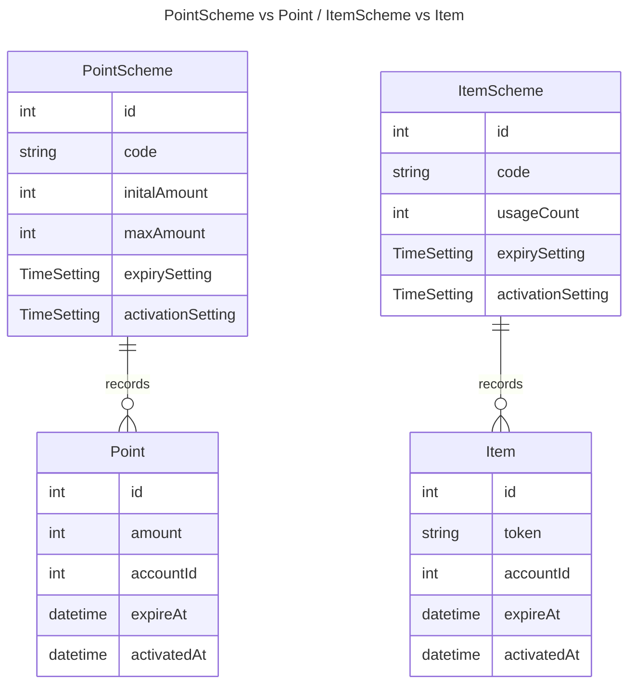

# Loyalty Engine

## Introduction

For standardization, JuicySuite uses **Loyalty Engine** to manage all loyalty related data. Loyalty Engine is a set of rules and data structures that standardize the data flow of loyalty related actions. It is the core of JuicySuite Platform and Starter.

## Entities (Elements)

There are **7 Entities** in Loyalty Engine. For more organizated and easy to memories, Entities can be separated into 3 categories: **Account**, **Basics Components** and **Interactive Components**.

 - **Account** (Represent a member of the loyalty program)
 - Basics Components
     - **Point** (Redemption, Credit, etc.)
     - **Item** (Discount, Voucher, Gift, etc.)
     - **Tier** (Bronze, Silver, Gold, etc.)
 - Interactive Components
     - **Reward** (Redeem or Earn "Components")
     - **Mission** (Complete a task to earn rewards)
     - **Event** (Attend an event to archive mission)



## Scheme vs Record

 - **Scheme** is the definition of an entity. It defines the structure of an entity. For example, a Tier Scheme defines the structure of a Tier. It defines the name, description, and expiring rules of the Tier.
 - **Record** is the instance of an entity. For example, a Tier Record is an instance of a Tier Scheme. It defines the account holder, expiry date, and status of the Tier.
 - We always said "ItemScheme" "PointScheme" during loyalty setup. But when we are talking about the data, we always said "Item" "Point", etc.



## Event Driven Design

To standardize the data flow, we use event driven design. Any loyalty related actions will be triggered by an **event**. For example, when a member buy something, a "order" **event** will triggered, which will pass through **missions** and **checkpoints**. If the member is eligible for a mission, the mission will be triggered and the member will earn **rewards**.

```mermaid
---
title: Event Trigger
---
stateDiagram-v2
    state is_mission_archive <<choice>>
    Signup --> Missions
    Visit --> Missions
    Order --> Missions
    Missions --> is_mission_archive: Calculated by formula, checkpoints
    is_mission_archive --> [*]: No achievements, do nothing
    is_mission_archive --> Reward: Mission archived, earn reward
``````

## `CODE` of every schemes

`code` have to be defined in every scheme. It is a unique identifier of the scheme. It is widely used in application or programmatically. Since ID may not be same across different environments, `Code` is used to identify the scheme.
##### Naming practices
- Hyphenated lowercase
- No spaces
- Better if no special characters
- Must explain the meaning of the scheme
- Examples
    - RewardScheme: `tier-gold-milestone`
    - ItemScheme: `voucher-10-percent`
- For multiple merchant setup (platform), it is recommended to prefix the code with merchant code
    - `merchant1-tier-gold-milestone`
    - `merchant2-tier-gold-milestone`

## Grouping

 - `group_id` exist in account and every scheme. It is for isolating schemes with each other. In other words, different group means different "Loyalty Program"
 - For example, if you have 2 loyalty programs, you can create 2 groups, and create all schemes under the group. This will prevent the schemes from being mixed up.
 - A `NULL` `group_id` means the scheme is shared across all groups. For example, a `PointScheme` with `group_id` `NULL` means the point can be earned by any account in any group.

```mermaid
---
title: Interaction of Group and Scheme
---
flowchart TD
    subgraph "Group 1"
    a1(Account)-->sp1(Point Scheme)
    end
    subgraph "Group 2"
    a2(Account)-->sp2(Point Scheme)
    end
    an(Account)-->spn(Point Scheme)
    a1 x-.Not Allowed.-xsp2
    a2 x-.Not Allowed.-xsp1
    a1-->spn
    a2-->spn
    an-->sp1
    an-->sp2
```
